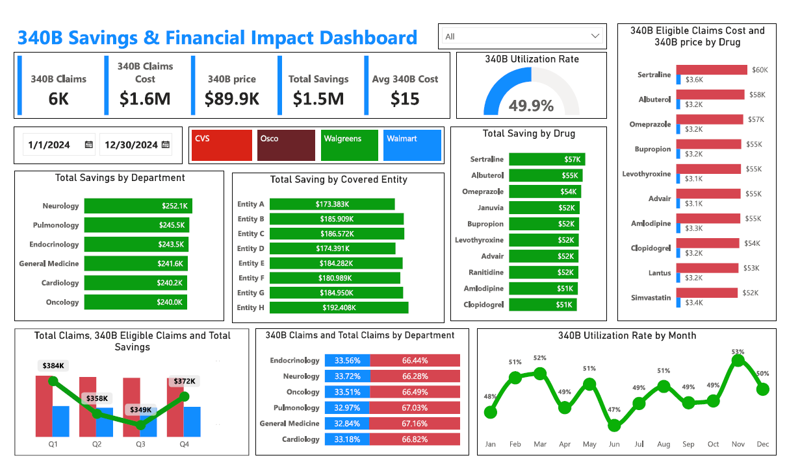

# 340B-Covered-Entity-Data-Integration-Analytics-Dashboard

## Overview
This project streamlines **340B program data ingestion, storage, and analytics** for a hospital by building an **automated data pipeline** from contracted pharmacies to a **Power BI dashboard** for stakeholders.This dashboard provides insights into 340B program savings and financial impact for a hospital. It visualizes claims, costs, savings, utilization rates, and drug-level expenses, helping stakeholders make data-driven decisions.

## Note: The data used in this dashboard is synthetic and was generated using Python libraries like Pandas and Faker to simulate real-world scenarios.

## 📸 Dashboard Preview  
Here’s a preview of the **Hospital Billing Dashboard**:  

## Key Components

### Data Ingestion
- Developed a **web portal using Python (Flask)** for contracted pharmacies to upload **340B transaction data**.

### Cloud Storage
- Stored uploaded data in **Google Cloud Storage (GCS)**.

### Automation
- Implemented **Google Cloud Functions** to trigger data processing when new files are uploaded.

### Data Processing
- Created a **master table in BigQuery**, consolidating data from multiple sources.

### Visualization
- Integrated **BigQuery with Power BI** to develop an **interactive dashboard** for hospital stakeholders.

## Technologies Used
- **Programming Language:** Python
- **Web Framework:** Flask
- **Cloud Services:** Google Cloud Storage (GCS), **Google Cloud Functions, BigQuery**
- **BI Tool:** Power BI
- **Database & Querying:** BigQuery SQL
## Key Features

### 1. **Summary Metrics (Top KPI Cards)**
- **Total 340B Claims**: 6K
- **340B Claims Cost**: $1.6M
- **340B Price**: $89.9K
- **Total Savings**: $1.5M
- **Average 340B Cost per Claim**: $15
- **340B Utilization Rate**: 49.9%

### 2. **Filtering Options**
- **Date Range Selector**: Allows users to filter data within a specific date range.
- **Pharmacy Selection**: Filters data based on pharmacies such as CVS, Osco, Walgreens, and Walmart.

### 3. **Savings Breakdown**
- **Total Savings by Department**:
  - Neurology: $252.1K
  - Pulmonology : $245.5k
  - Endocrinolog : $243.5k
  - General Medicine : $241.6k
  - Cardiology : $240.2k
  - Oncology : $240.0k
- **Total Savings by Covered Entity**: 
  - Entity H saved the most with $192.4K.
- **Total Savings by Drug**: 
  - Sertraline: $57K
  - Albuterol: $55K
  - Omeprazole: $54K
  - Januvia: $52K

### 4. **Cost & Price Analysis**
- **340B Eligible Claims Cost vs. 340B Price by Drug**: Compares the cost of eligible claims with the 340B pricing, highlighting cost savings for each drug.

### 5. **Trends & Utilization Insights**
- **Total Claims, Eligible Claims, & Savings per Quarter**: Visualizes quarterly trends, showing fluctuations in claims and savings.
- **340B Claims vs. Total Claims by Department**: Displays the percentage distribution of claims across different departments.
- **340B Utilization Rate by Month**: Shows monthly utilization trends, with the peak in November at 53%.
## Outcome
- **Automated data ingestion and processing**, reducing manual intervention.
- **Improved data accessibility and reporting** for hospital stakeholders.
- **Enhanced tracking** of **340B program performance, pharmacy transactions, and compliance metrics**.
